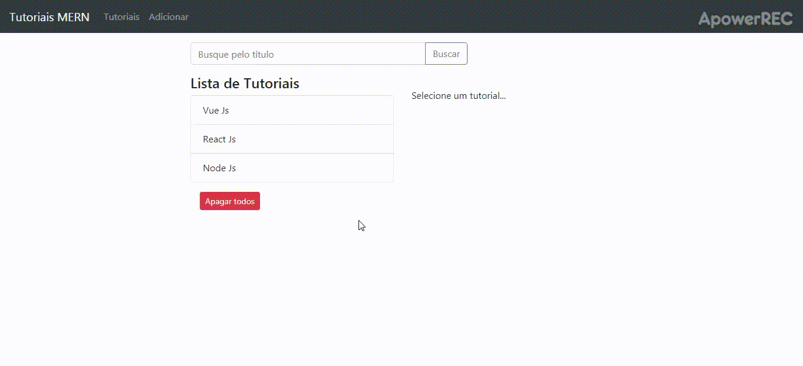

## Aplicação fullstack utilizando MongoDB, NodeJs, React e BootStrap

  
  
  
  
   
  

Projeto MERN Stack (MongoDB + Express Js + React Js+ Node Js) criando um título e uma descrição de tutoriais: listando, criando, alterando, deletando e também apagando todos os registros.

Back-end usando o express, mongoose e front-end com React e Bootstrap. 
Banco de dados MongoDB utilizado dentro do Docker. 
Instale o docker desktop ou docker toolbox se for Windows 7. Baixe a imagem do mongodb dentro do docker, ou instale o MongoDB diretamente. Para gerenciar o banco utilize o Robo 3T.

Projeto feito baseado com o https://codingthesmartway.com/

1° passo -> npm install
2° passo -> Na pasta back-end rode node server.js
3° passo -> Na pasta front-end rode npm start
4° passo -> Acesse o http://localhost:8081